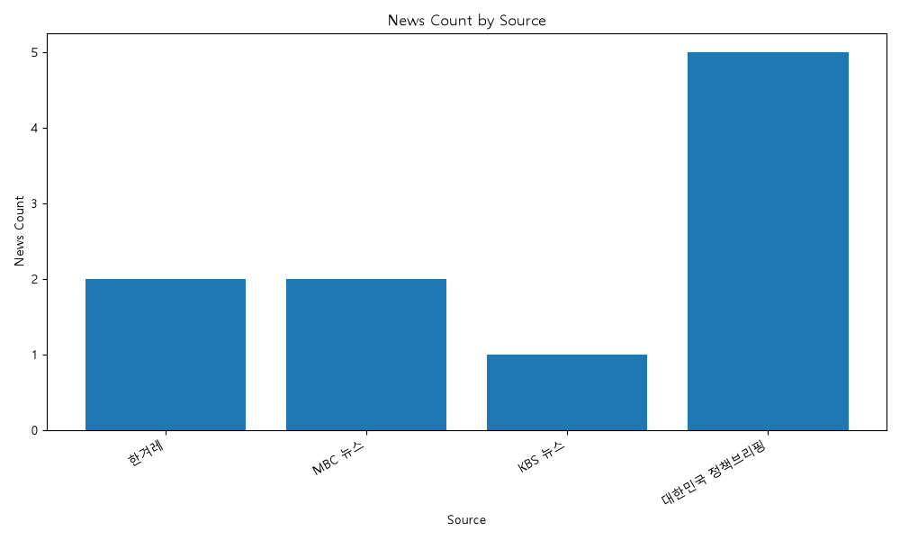
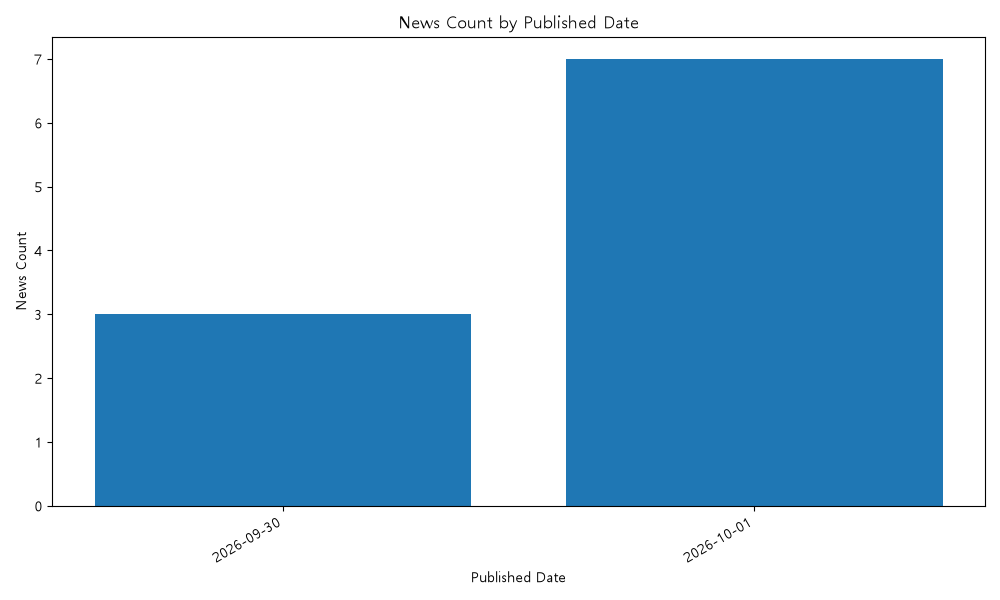

# AI 뉴스 트렌드 및 종합 분석 리포트

## 1. 분석 개요

- 전체 뉴스 수: 10건
- 분석 기간: 2026-09-30 ~ 2026-10-01
- 뉴스 출처 수: 4개

## 2. 데이터 품질 지표

- 필수 필드 완전성: 100.0%
- 본문 보유율: 50.0%
- 중복률: 0.0%

## 3. 중요도 TOP 5 뉴스

### 1. [속보] 이 대통령 “DMZ 사고 마음 무거워…남북 군사 긴장 낮추겠다” - 한겨레

- 출처: 한겨레
- 중요도: 3
- 요약: [속보] 이 대통령 “DMZ 사고 마음 무거워…남북 군사 긴장 낮추겠다” - 한겨레 관련 뉴스입니다.

### 2. 정부, '삼성 합병' 엘리엇에 ISDS 다시 패소‥660억 원 배상해야 - MBC 뉴스

- 출처: MBC 뉴스
- 중요도: 3
- 요약: 정부, '삼성 합병' 엘리엇에 ISDS 다시 패소‥660억 원 배상해야 - MBC 뉴스 관련 뉴스입니다.

### 3. 동대구역 '박정희 동상' 철거 요구 '기각'‥1심서 철도공사 패소 - MBC 뉴스

- 출처: MBC 뉴스
- 중요도: 3
- 요약: 동대구역 '박정희 동상' 철거 요구 '기각'‥1심서 철도공사 패소 - MBC 뉴스 관련 뉴스입니다.

### 4. 김민석 “대통령이 김지용 관련 ‘거짓 프레임’에 명료하게 설명” - KBS 뉴스

- 출처: KBS 뉴스
- 중요도: 3
- 요약: 김민석 “대통령이 김지용 관련 ‘거짓 프레임’에 명료하게 설명” - KBS 뉴스 관련 뉴스입니다.

### 5. 10월 달력 펴자마자 ‘만추’…하루 새 5도 ‘뚝’, 강풍에 체감온도 더 낮아 - 한겨레

- 출처: 한겨레
- 중요도: 3
- 요약: 10월 달력 펴자마자 ‘만추’…하루 새 5도 ‘뚝’, 강풍에 체감온도 더 낮아 - 한겨레 관련 뉴스입니다.

## 4. AI 인사이트 분석

### 주요 이슈

- 현재는 Mock 분석 결과입니다.
- 실제 API 연결 후 주요 뉴스 이슈를 분석합니다.

### 주요 트렌드

- 현재는 Mock 트렌드 분석입니다.
- 실제 API 연결 후 뉴스 전체의 흐름을 분석합니다.

### 핵심 키워드

- Mock 키워드 1
- Mock 키워드 2
- Mock 키워드 3

### 시사점

- 현재는 Mock 인사이트입니다.
- 실제 API 연결 후 뉴스 데이터를 기반으로 핵심 인사이트를 생성합니다.

## 5. 시각화

### 출처별 뉴스 건수

### 일자별 뉴스 건수

