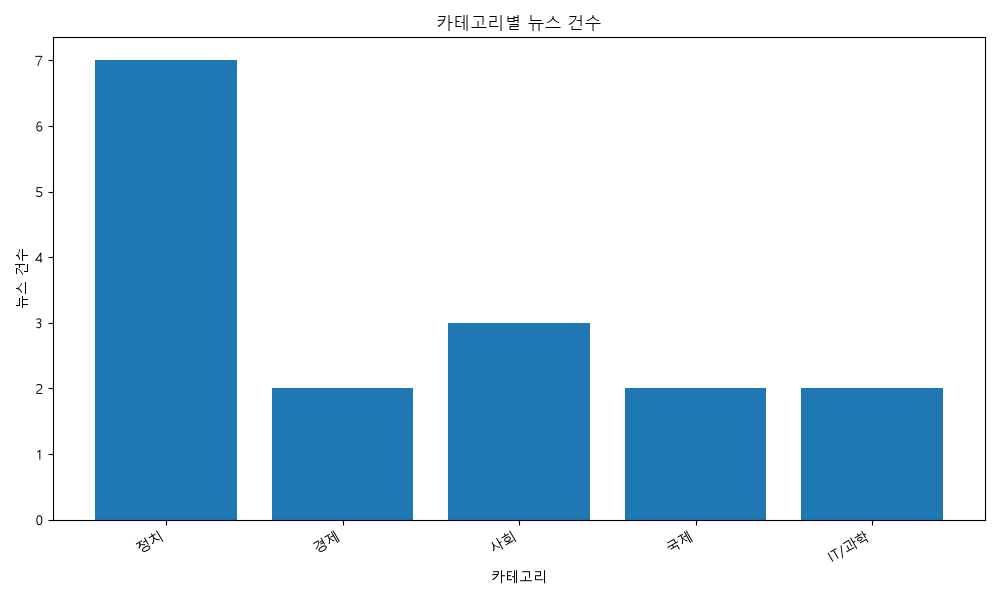
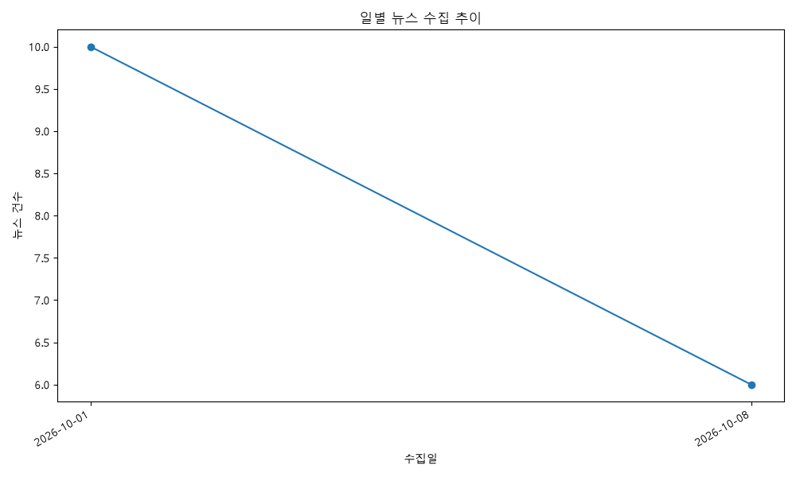

# AI 뉴스 트렌드 및 종합 분석 리포트

## 1. 분석 개요

- 전체 뉴스 수: 16건
- 분석 기간: 2026-09-30 ~ 2026-10-08
- 뉴스 출처 수: 5개

## 2. 데이터 품질 지표

- 필수 필드 완전성: 100.0%
- 본문 보유율: 50.0%
- 중복률: 0.0%

## 3. 중요도 TOP 5 뉴스

### 1. [속보] 이 대통령 “DMZ 사고 마음 무거워…남북 군사 긴장 낮추겠다” - 한겨레

- 출처: 한겨레
- 중요도: 5
- 요약: 이 대통령은 DMZ에서 발생한 사고에 대해 마음이 무겁다며 깊은 유감을 표했다. 정부는 남북 군사적 긴장을 낮추기 위해 노력하겠다고 밝혔다.

### 2. 한미 전략투자 1호 '텍사스 가스발전' 추진…알래스카 LNG 검토 착수

- 출처: 대한민국 정책브리핑
- 중요도: 5
- 요약: 한미 양국은 전략적투자 MOU에 따라 텍사스 엔시날에 AI 데이터센터용 6472MW·223억 달러 규모의 가스복합화력 '프로젝트 스타'를 제1호 전략투자사업으로 추진하고, 한미 원전 프레임워크를 통해 미국 내 APR1400 2기·AP1000 6기 등 대형원전 8기 건설을 위한 최대 1200억 달러 규모 자금 지원에 큰 틀에서 합의했으며, 알래스카 LNG 프로젝트에 대한 검토도 착수했다. 양국은 우산형 SPV와 리스크 풀링, 원리금 회수 전 개별 프로젝트 배분비율 5:5 유지 등 투자보호 장치를 마련하고 한국 기업의 기자재·시공 참여 확대와 우호적 조건(관세 인하·우선 구매권 등)을 확보하기로 했다.

### 3. 누리호 5차 발사 '성공'…초소형 위성 5기 첫 동시 투입

- 출처: 대한민국 정책브리핑
- 중요도: 5
- 요약: 한국형 발사체 누리호가 5차 발사에서 목표궤도에 초소형군집위성 5기와 큐브위성 9기를 성공적으로 분리·투입하며 발사에 성공했다. 저충격 분리장치와 충돌 방지 절차를 적용해 다수 위성 동시 투입 역량을 높였고, 민간의 발사운용 참여 확대와 연간 발사 계획을 통해 상업 발사서비스 체제로 전환을 추진한다고 밝혔다.

### 4. 정부, '삼성 합병' 엘리엇에 ISDS 다시 패소‥660억 원 배상해야 - MBC 뉴스

- 출처: MBC 뉴스
- 중요도: 4
- 요약: 정부가 '삼성 합병'을 둘러싼 엘리엇의 ISDS(투자자-국가 분쟁 해결) 소송에서 다시 패소해 약 660억 원을 배상하라는 판정을 받았다. 이번 판결은 삼성 합병 관련 정부 조치에 대한 국제 중재 결과로, 정부의 책임과 재정적 부담이 확정된 것이다.

### 5. 지원은 넓히고 생활은 편리하게…10월부터 달라지는 제도

- 출처: 대한민국 정책브리핑
- 중요도: 4
- 요약: 10월부터 양육·노동·교통·통신·행정·산업 등 일상과 기업활동에 관련된 제도가 대거 바뀌어 지원 문턱은 낮아지고 편의성은 높아지는 반면 임금 체불 처벌·원산지 표시 등 기업의 사회적 책임은 강화된다. 주요 내용으로는 양육비 선지급제의 소득기준 폐지로 모든 소득층 신청 가능(미성년자 1인당 월 20만 원 지원), 철도 승차권 예매 기간 1개월에서 2개월로 확대, 임금 체불 사업주 처벌 강화, 이동통신 요금제 맞춤 안내 의무화 및 여권 다수 묶음 우편수령 등 편의 확대와 AI·공공조달·산업지원·농축산 관련 제도 변경 등이 있다.

## 4. AI 인사이트 분석

### 주요 이슈

- 안보·정치 불안과 제도적 공백: DMZ 사고로 남북 군사 긴장 완화 필요성이 제기되는 한편, 대법관 공백·국감 논란 등 정치·사법 영역의 불안이 지속.
- 경제적 부담과 전략투자 병행: 엘리엇 ISDS 패소로 정부에 금전적 부담(약 660억 원)이 확정되는 동시에, 한미 대형 에너지·원전·데이터센터 등 대규모 전략투자가 추진되어 재정·외교적 과제가 병존.
- 사회·기술 정책 전환 가속: 10월 제도 변경(복지·편의 확대·기업 책임 강화), 농지 전수조사·처분 면제 정책, 국가 AI 안전 종합계획 수립 및 누리호 발사 성공 등 사회정책과 기술·산업 정책의 동시 추진.

### 주요 트렌드

- 정부 주도의 규제·지원 재편: 복지·소비 진작(온누리상품권 등)과 기업 책임 강화(임금체불 처벌·원산지 표시 강화)를 동시에 추진.
- 전략적 대외경제 협력 확대: 한미 전략투자, 한-이집트 MOU 등 에너지·인프라 중심의 외교·경제 협력이 강화되는 흐름.
- 기술·안전 규범 정비 가속화: AI 안전 마스터플랜 수립과 우주·민간 발사 역량 강화(누리호 성공)로 기술 상용화와 안전관리 병행 추진.

### 핵심 키워드

- DMZ 사고·남북 긴장
- ISDS 엘리엇 배상
- 농지 전수조사·처분 면제
- 한미 전략투자(프로젝트 스타·원전)
- 국가 AI 안전 종합계획

### 시사점

- 정책 균형 필요성: 안보·정치 리스크 관리, 국내 재정 부담(국제 중재 패소)과 전략적 외자 유치·투자 보호의 균형을 정부가 동시에 맞춰야 함.
- 내수·사회안전망 강화와 규제 강화의 병행: 소비·복지 지원을 넓히면서 기업의 사회적 책임을 강화하는 방향은 단기 경기지원을 통해 민생을 안정시키려는 의도로 보이나, 기업 부담과 집행 현실성 관리가 중요.
- 기술경쟁력과 규제체계 동시 강화: 누리호 성공과 AI 안전 마스터플랜은 상용화 및 국제협력 기회를 열지만, 동시에 안전·거버넌스 체계를 조속히 정비해 신기술 리스크를 관리해야 함.

## 5. 시각화

### 카테고리별 뉴스 건수

### 일별 뉴스 수집 추이

